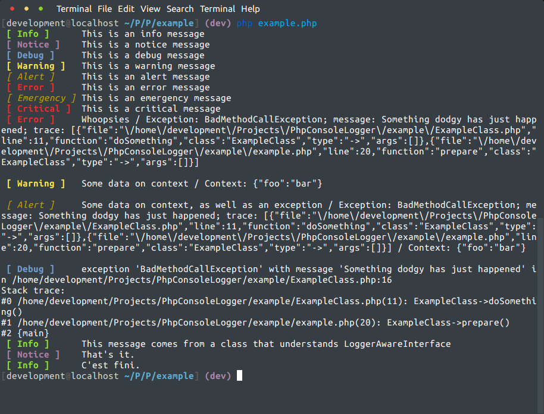

[](https://travis-ci.org/AuronConsultingOSS/PhpConsoleLogger)
[](https://codeclimate.com/github/AuronConsultingOSS/PhpConsoleLogger)
[](https://codeclimate.com/github/AuronConsultingOSS/PhpConsoleLogger/coverage)

# PHP Console Logger
PhpConsoleLogger is a small class that implements a way to display messages in a console with an interface which is
PSR-3 compatible. This means you can drop it in as a logger on code that is PSR-3 LoggerAwareInterface compatible and away
you go.

This logger is really meant to be used for command line scripts due to shell-specific colouring commands.

You might want to use this on those command line scripts we all use to do things like migrations, data fixes etc; without
the overhead of adding a full-on PHP console suite.

## Requirements
PHP 7.2+
ext-json

## Installation
The preferred method is through composer, via ```composer require auron-consulting-oss/php-console-logger```. You can always download
and install manually, but you'd need to somehow shoehorn both psr/log and PhpConsoleLogger into your autoload mechanism.

## Usage
```php
// No timestamps (default)
$consoleLogger = new AuronConsultingOSS\Logger\Console(false);

// With timestamps
$console = new AuronConsultingOSS\Logger\Console(true);

[ ... ]

// Then, simply use like a regular PSR-3 logger
$console->info('Whatever', ['extra_stuff' => 'maybe']);
```

## Contributing

Fork this repo, do your stuff, send a PR. Tests are mandatory:

  * PHP unit coverage must be 100%
  * Infection MSI must be 100%
  * PHPStan must show no errors 
  
The provided [Makefile](Makefile) has all the basic test targets and is what's in use in CI.

## Examples

I have provided with an example (code and output below) you can run by running ```php example/example.php```.

```php
<?php
require '../vendor/autoload.php';
require 'ExampleClass.php';

$console = new AuronConsultingOSS\Logger\Console();

// Straight string messages
$console->info('This is an info message');
$console->notice('This is a notice message');
$console->debug('This is a debug message');
$console->warning('This is a warning message');
$console->alert('This is an alert message');
$console->error('This is an error message');
$console->emergency('This is an emergency message');
$console->critical('This is a critical message');

// Messages with exceptions and traces
try {
    $exampleClass = new ExampleClass();
    $exampleClass->prepare();
} catch (Exception $ex) {
    $console->error('Whoopsies', ['exception' => $ex]);
}

// Messages with random data
$console->warning('Some data on context', ['foo' => 'bar']);

// Messages with random data plus exception
$console->alert('Some data on context, as well as an exception', ['foo' => 'bar', 'exception' => $ex]);

// Passing on an exception directly as a message (or any object that implements __toString)
$console->debug($ex);

// Since we're PSR-3, we can be injected on objects that understand LoggerAwareInterface - example class does
$exampleClass->setLogger($console);
$exampleClass->runLoggerAwareExample();

// You get the idea
$console->notice('That\'s it.');
$console->info('C\'est fini.');
```

Which looks like:

